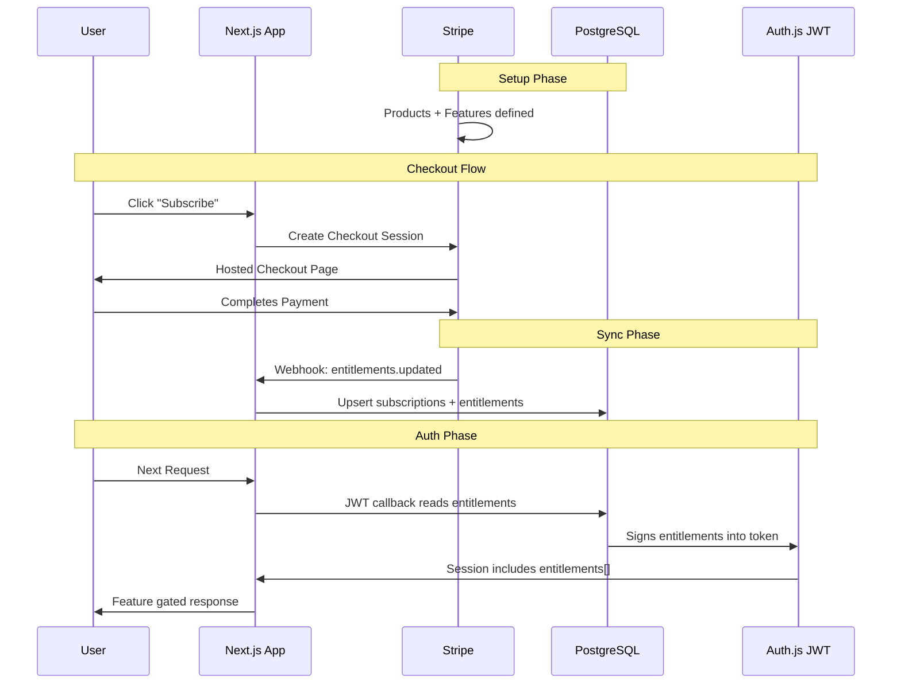

# Stripe Subscription & Entitlements Integration

## Architecture



## 1. Database Schema

Add two new tables to [`src/db/schema.ts`](src/db/schema.ts), following existing conventions (`uuid("id").defaultRandom().primaryKey()`, `.$type<>()` for text enums, `{ onDelete: "cascade" }` on user FKs, `.unique()` on userId for one-per-user tables like `integrations`):

- **`subscriptions`** -- Tracks a user's Stripe subscription (one row per user). Columns: `id` (uuid, defaultRandom, PK), `userId` (uuid FK to users, unique, cascade), `stripeSubscriptionId` (text, unique), `stripeProductId` (text), `stripePriceId` (text), `status` (text, `.$type<"active" | "canceled" | "past_due" | "trialing" | "incomplete">()`), `currentPeriodStart` (timestamp), `currentPeriodEnd` (timestamp), `cancelAtPeriodEnd` (boolean, default false), `createdAt`, `updatedAt`.

- **`user_entitlements`** -- Cache of a user's active entitlements (synced from Stripe's `entitlements.active_entitlement_summary.updated` webhook). Columns: `id` (uuid, defaultRandom, PK), `userId` (uuid FK to users, cascade), `lookupKey` (text, not null), `grantedAt` (timestamp, defaultNow). Composite unique on `(userId, lookupKey)`. This table is the source of truth for JWT signing.

Also add `stripeCustomerId` (text, unique) column to the existing `users` table for quick lookups.

> **Note:** No `feature_flags` mapping table is needed. Stripe's Entitlements API manages the product-to-feature mapping. The webhook delivers lookup keys directly, which we store in `user_entitlements`.

## 2. Stripe Billing Module

Create [`src/lib/billing/stripe.ts`](src/lib/billing/stripe.ts) with exported functions:

```typescript
// Initializes Stripe client using config.stripeSecretKey
export function getStripeClient(): Stripe;
export async function createCheckoutSession(userId: string, priceId: string, returnUrl: string): Promise<{ url: string }>;
export async function createPortalSession(customerId: string, returnUrl: string): Promise<{ url: string }>;
export async function constructWebhookEvent(body: string, signature: string): Promise<Stripe.Event>;
```

No abstract `BillingProvider` interface or `index.ts` re-export — we only use Stripe and can refactor if that changes. Keep it simple.

## 3. Environment Config

Add to [`src/shared/config.ts`](src/shared/config.ts):

- `stripeSecretKey` -- `STRIPE_SECRET_KEY`
- `stripeWebhookSecret` -- `STRIPE_WEBHOOK_SECRET`  
- `stripePublishableKey` -- `NEXT_PUBLIC_STRIPE_PUBLISHABLE_KEY` (client-safe)

## 4. API Routes

| Route | Method | Purpose |

|---|---|---|

| `/api/billing/checkout` | POST | Creates a Stripe Checkout session, redirects user |

| `/api/billing/portal` | POST | Creates a Stripe Customer Portal session |

| `/api/webhooks/stripe` | POST | Receives Stripe webhook events (no auth required) |

| `/api/billing/entitlements` | GET | Returns current user's active entitlements |

Add these to [`src/app/routes.ts`](src/app/routes.ts) under new `billing` and `webhooks` route groups. The webhook route must be excluded from auth middleware.

### Webhook Handler

Handles these Stripe events:

- `entitlements.active_entitlement_summary.updated` -- Syncs entitlements to `user_entitlements` table
- `customer.subscription.created/updated/deleted` -- Syncs subscription status to `subscriptions` table
- `checkout.session.completed` -- Links `stripeCustomerId` to user

## 5. JWT & Session Enhancement

Modify [`src/auth.ts`](src/auth.ts) JWT callback to fetch entitlements from `user_entitlements` alongside the existing `role` query (piggyback on the DB call that already runs on every request). Sign them into the token as `token.entitlements: string[]`. Forward in the session callback as `session.user.entitlements = token.entitlements`.

Extend [`src/types/next-auth.d.ts`](src/types/next-auth.d.ts) to add `entitlements: string[]` to `JWT`, `Session.user`, and `User` interfaces.

## 6. Feature Gating Utilities

Create [`src/lib/entitlements.ts`](src/lib/entitlements.ts) with helpers:

```typescript
function hasEntitlement(session: Session, key: string): boolean;
function requireEntitlement(key: string): Promise<{ session, error? }>;
```

The `requireEntitlement` helper follows the existing `requireAuth`/`requireAdmin` pattern in [`src/lib/api-auth.ts`](src/lib/api-auth.ts).

## 7. Billing Settings Page

Create [`src/app/(app)/settings/billing/page.tsx`](src/app/\\\\\\\(app)/settings/billing/page.tsx):

- Shows current plan name and status (active, canceled, trial)
- Shows current period end date
- "Manage Subscription" button that redirects to Stripe Customer Portal
- "Upgrade" button if on free tier, redirects to Stripe Checkout
- Add a "Billing" link to the existing settings page at [`src/app/(app)/settings/page.tsx`](src/app/\\\\\\\(app)/settings/page.tsx), alongside the existing "Integrations" link

Add `billing` sub-route under `settings` in [`src/app/routes.ts`](src/app/routes.ts).

## 8. Shot View Limit & Upgrade Banner

### Entitlement

Configure a `no-shot-view-limit` entitlement in Stripe's dashboard, mapped to the Pro product. Users without this entitlement are capped at viewing their most recent N shots from history. No local seed script needed — Stripe manages the mapping.

### Config

Add to [`src/shared/config.ts`](src/shared/config.ts):

- `shotViewLimit` -- `SHOT_VIEW_LIMIT`, defaults to `100`. The maximum number of shots a free-tier user can view from history.

### Server-Side Enforcement

In [`src/app/api/shots/route.ts`](src/app/api/shots/route.ts), after authentication, check if the user has the `no-shot-view-limit` entitlement (from `session.user.entitlements`). If not, clamp the effective `limit + offset` so it never exceeds `config.shotViewLimit`. Also return a `X-Shot-View-Limit` and `X-Shot-Total-Count` response header so the client knows the cap and the user's total shot count.

### Client-Side Banner

Create [`src/components/billing/ShotLimitBanner.tsx`](src/components/billing/ShotLimitBanner.tsx):

- Reads `session.user.entitlements` via `useSession()` to check for `no-shot-view-limit`
- If the user does NOT have the entitlement, compare their total shot count against `shotViewLimit` (passed as a prop or fetched from a lightweight count endpoint)
- **Within 10% of limit** (90+ of 100): Show an amber/warning banner: "You've logged {count} of {limit} shots. Upgrade to Pro for unlimited history."
- **At or over limit** (100+): Show a red/urgent banner: "You've reached your {limit}-shot history limit. Upgrade to Pro to view all your shots."
- Both banners include a CTA link to `/settings/billing` (using `AppRoutes.settings.billing.path`)
- Users WITH the entitlement see no banner

Place the banner at the top of `ShotsPage` in [`src/app/(app)/shots/page.tsx`](src/app/\\\\\(app)/shots/page.tsx), above the table/card list.

### Shot Count

Add a lightweight `GET /api/shots/count` endpoint (or add a `totalCount` field to the existing shots response metadata) that returns the user's total shot count regardless of limit, so the banner can compare against the cap without fetching all shots.

## 9. Middleware Update

Update [`src/middleware.ts`](src/middleware.ts) matcher regex to add `api/webhooks/stripe` to the exclusion group (alongside existing `api/auth|api/health`). Stripe signs its own requests via webhook secret verification.

## 10. npm Dependencies

Add to [`package.json`](package.json):

- `stripe` (server-side SDK)

## Tasks

### Phase 1: Foundation

- [x] Install `stripe` npm package (`pnpm add stripe`)
- [x] Add Stripe env vars (`STRIPE_SECRET_KEY`, `STRIPE_WEBHOOK_SECRET`, `NEXT_PUBLIC_STRIPE_PUBLISHABLE_KEY`) and `shotViewLimit` (`SHOT_VIEW_LIMIT`, default 100) to `src/shared/config.ts`
- [x] Add `subscriptions` and `user_entitlements` tables to `src/db/schema.ts`; add `stripeCustomerId` column to `users`
- [x] Generate migration `0009_worthless_hobgoblin.sql` with idempotent `CREATE TABLE IF NOT EXISTS` and `DO $$ BEGIN IF NOT EXISTS` guards

### Phase 2: Core Billing Infrastructure

- [x] Create `src/lib/billing/stripe.ts` — Stripe client singleton, `createCheckoutSession`, `createOrRetrieveCustomer`, `createPortalSession`, `constructWebhookEvent`
- [x] Add `billing`, `webhooks`, and `shots.count` to `ApiRoutes` in `src/app/routes.ts`; add `settings.billing` to `AppRoutes`
- [x] Add `api/webhooks/stripe` to middleware matcher exclusion regex in `src/middleware.ts`
- [x] Create `src/lib/entitlements.ts` — `hasEntitlement(session, key)` and `requireEntitlement(key)` following the `requireAuth` pattern

### Phase 3: Auth Integration

- [x] Extend `src/types/next-auth.d.ts` — add `entitlements: string[]` to `User`, `Session.user`, and `JWT`
- [x] Update `src/auth.ts` JWT callback to fetch `userEntitlements` alongside the existing `role` DB query; forward to session in session callback

### Phase 4: API Routes

- [x] Create `src/app/api/webhooks/stripe/route.ts` — handles `checkout.session.completed` (links `stripeCustomerId`), `customer.subscription.*` (upserts `subscriptions`), `entitlements.active_entitlement_summary.updated` (replaces `user_entitlements`)
- [x] Create `src/app/api/billing/checkout/route.ts` — POST, creates/retrieves Stripe customer then Checkout session
- [x] Create `src/app/api/billing/portal/route.ts` — POST, opens Stripe Customer Portal
- [x] Create `src/app/api/billing/entitlements/route.ts` — GET, returns `session.user.entitlements`
- [x] Create `src/app/api/shots/count/route.ts` — GET, returns `{ total, limit }` for free-tier banner

### Phase 5: UI

- [x] Create `src/app/(app)/settings/billing/page.tsx` — shows plan/status, period end, Manage/Upgrade buttons via portal
- [x] Add Billing link card to `src/app/(app)/settings/page.tsx` (above Integrations)
- [x] Update `src/app/api/shots/route.ts` — clamp `limit+offset` to `shotViewLimit` for free users; return `X-Shot-View-Limit` and `X-Shot-Total-Count` headers
- [x] Create `src/components/billing/ShotLimitBanner.tsx` — amber (≥90%) / red (≥100%) banner with upgrade CTA
- [x] Inject `ShotLimitBanner` at top of `src/app/(app)/shots/page.tsx` using `useQuery` on `/api/shots/count`

## File Summary

| File | Action |
|---|---|
| `package.json` | Add `stripe` dependency |
| `src/shared/config.ts` | Add Stripe env vars + `shotViewLimit` |
| `src/db/schema.ts` | Add `subscriptions`, `user_entitlements` tables; add `stripeCustomerId` to `users` |
| `drizzle/migrations/0009_worthless_hobgoblin.sql` | Generated + idempotent guards |
| `src/lib/billing/stripe.ts` | New -- Stripe client + checkout/portal/webhook helpers |
| `src/lib/entitlements.ts` | New -- `hasEntitlement()` + `requireEntitlement()` helpers |
| `src/app/routes.ts` | Add billing + webhook + count routes |
| `src/middleware.ts` | Exclude webhook route from auth matcher |
| `src/app/api/webhooks/stripe/route.ts` | New -- webhook handler |
| `src/app/api/billing/checkout/route.ts` | New -- checkout session |
| `src/app/api/billing/portal/route.ts` | New -- portal session |
| `src/app/api/billing/entitlements/route.ts` | New -- get entitlements |
| `src/app/api/shots/count/route.ts` | New -- lightweight shot count |
| `src/auth.ts` | Extend JWT callback to include entitlements |
| `src/types/next-auth.d.ts` | Add `entitlements: string[]` to types |
| `src/app/(app)/settings/billing/page.tsx` | New -- billing UI |
| `src/app/(app)/settings/page.tsx` | Add billing link |
| `src/app/api/shots/route.ts` | Enforce shot view limit for free users, add count headers |
| `src/components/billing/ShotLimitBanner.tsx` | New -- warning/limit banner component |
| `src/app/(app)/shots/page.tsx` | Add `ShotLimitBanner` above shot list |