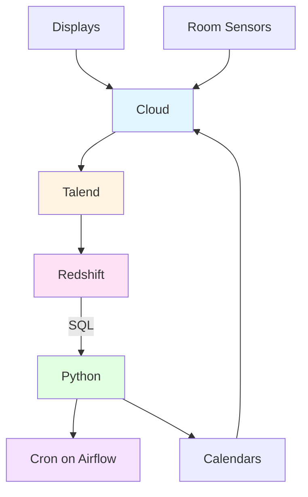

# Architecture Diagram

```mermaid
flowchart TD
    Displays --> Cloud
    Calendars --> Cloud
    RoomSensors["Room Sensors"] --> Cloud
    
    Cloud --> Talend
    Talend --> Redshift
    Redshift -->|SQL| Python
    Python --> Airflow["Cron on Airflow"]
    Python --> Calendars
    
    style Cloud fill:#e1f5ff
    style Talend fill:#fff4e1
    style Redshift fill:#ffe1f5
    style Python fill:#e1ffe1
    style Airflow fill:#f5e1ff
```
